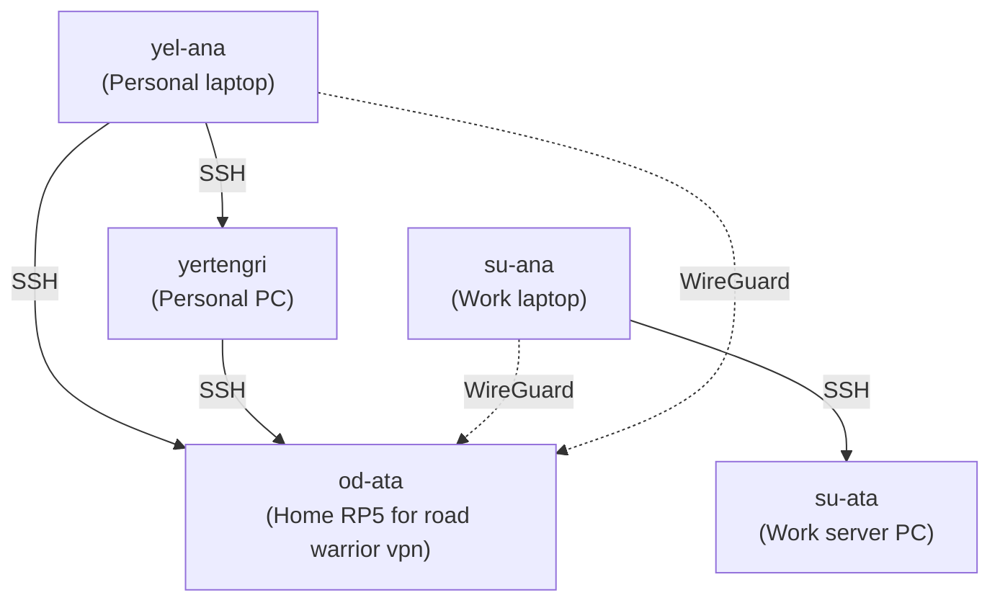

# Connectivity

Documenting connectivity between the different computers.

## Machines

| Hostname  | Description                   |
| --------- | :---------------------------- |
| yel-ana   | Personal laptop               |
| yertengri | Personal PC                   |
| su-ana    | Work laptop                   |
| su-ata    | Work server PC                |
|od-ata    | Home RP5 for road warrior vpn |

## Connectivity



## Keys

Directory structures for keys.
These are distributed from the encrypted usb drive only.

```
<yel-ana>
├── /etc/ssh/
│   ├── age_host_ed25519_key
│   ├── age_host_ed25519_key.pub
│   ├── age_all_ed25519_key
│   ├── age_all_ed25519_key.pub
│   ├── ssh_host_ed25519_key
│   ├── ssh_host_ed25519_key.pub
│   ├── ssh_all_ed25519_key
│   └── ssh_all_ed25519_key.pub
└── /home/batuhan/.ssh/
    ├── id_ed25519_GITHUB
    ├── id_ed25519_GITHUB.pub
    ├── id_ed25519_YERTENGRI
    ├── id_ed25519_YERTENGRI.pub
    ├── id_ed25519_OD-ATA
    ├── id_ed25519_OD-ATA.pub
    ├── batuhan_age_keys.txt
    └── known_hosts

<yertengri>
├── /etc/ssh/
│   ├── age_host_ed25519_key
│   ├── age_host_ed25519_key.pub
│   ├── age_all_ed25519_key
│   ├── age_all_ed25519_key.pub
│   ├── ssh_host_ed25519_key
│   ├── ssh_host_ed25519_key.pub
│   ├── ssh_all_ed25519_key
│   └── ssh_all_ed25519_key.pub
└── /home/batuhan/.ssh/
    ├── id_ed25519_GITHUB
    ├── id_ed25519_GITHUB.pub
    ├── id_ed25519_OD-ATA
    ├── id_ed25519_OD-ATA.pub
    ├── batuhan_age_keys.txt
    ├── known_hosts
    └── authorized_keys

<su-ana>
├── /etc/ssh/
│   ├── age_host_ed25519_key
│   ├── age_host_ed25519_key.pub
│   ├── age_all_ed25519_key
│   ├── age_all_ed25519_key.pub
│   ├── ssh_host_ed25519_key
│   ├── ssh_host_ed25519_key.pub
│   ├── ssh_all_ed25519_key
│   └── ssh_all_ed25519_key.pub
└── /home/batuhan/.ssh/
    ├── id_ed25519_GITHUB
    ├── id_ed25519_GITHUB.pub
    ├── id_ed25519_SU-ATA
    ├── id_ed25519_SU-ATA.pub
    ├── batuhan_age_keys.txt
    └── known_hosts

<su-ata>
├── /etc/ssh/
│   ├── age_host_ed25519_key
│   ├── age_host_ed25519_key.pub
│   ├── ssh_host_ed25519_key
│   └── ssh_host_ed25519_key.pub
└── /home/batuhan/.ssh/
    ├── id_ed25519_GITHUB
    ├── id_ed25519_GITHUB.pub
    ├── batuhan_age_keys.txt
    ├── known_hosts
    └── authorized_keys

<od-ata>
├── /etc/ssh/
│   ├── age_host_ed25519_key
│   ├── age_host_ed25519_key.pub
│   ├── ssh_host_ed25519_key
│   └── ssh_host_ed25519_key.pub
└── /home/batuhan/.ssh/
    ├── batuhan_age_keys.txt
    ├── known_hosts
    └── authorized_keys
```

### SOPS

Keys deployed through SOPS;
- Syncthing
  * Everyone keeps their private keys, certificate and rest api key in sops.
  * Public keys are all included in the Syncthing module.
  * Rest API keys are in the joint secret file, and duplicated in home-manager sops.
- Wireguard
  * Each machine keeps it's own private key.
  * Public keys of all machines available in od-ata `secrets.yaml` file

```
secrets.yaml
├── syncthing
│   ├── rest
│   │   └── <hostname>
│   ├── key
│   └── cert
└── wireguard
    ├── private
    └── public
        └── <hostname>
```
